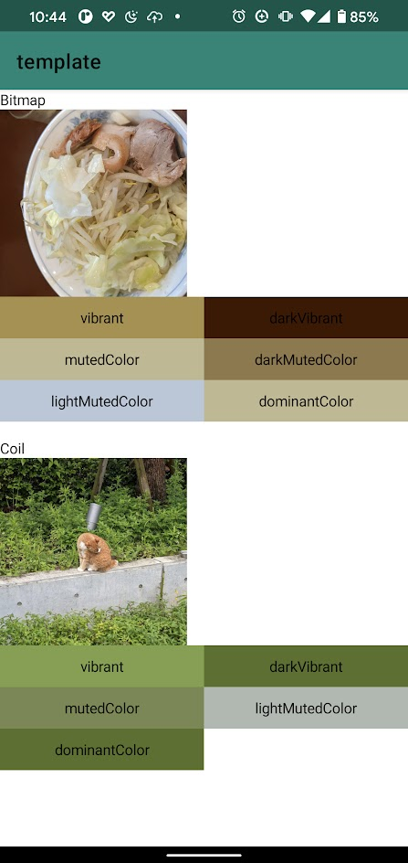

# Palette for Jetpack Compose

make the [Palette](https://developer.android.com/training/material/palette-colors) easy to use from Jetpack Compose



## Install

```groovy
// get Palette from R.drawable.xxx(Bitmap) or ImageBitmap
implementation "com.github.satoshun.compose.palette:palette:0.0.2"

// get Palette by Coil
implementation "com.github.satoshun.compose.palette:coil:0.0.2"
```

## Usage

### generate Palette from Bitmap

```kotlin
// Get Palette
val bitmap = ImageBitmap.imageResource(id = R.drawable.image)
val paletteState = rememberPaletteState(imageBitmap = bitmap)

// Use Palette
paletteState.palette
paletteState.darkVibrant
```

### generate external source by Coil

```kotlin
// Get Palette
val url = "..."
val paletteState = rememberCoilPaletteState(data = url)
```
